basic concept of:

= Cloud computing

=== Kubernetes

==== CNCF organization members

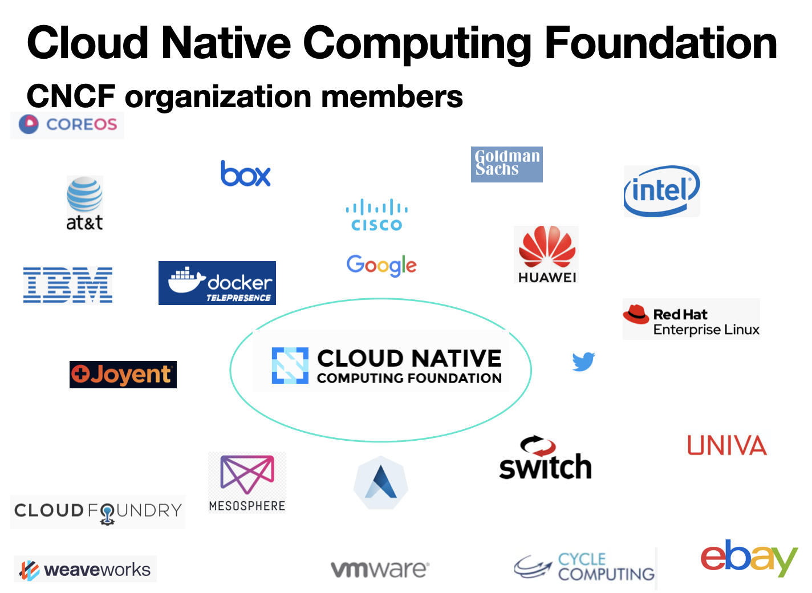

==== Deployment

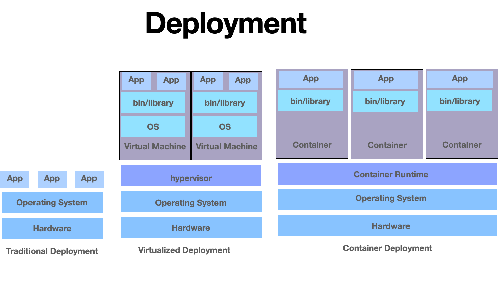

==== Kubernetes Cluster
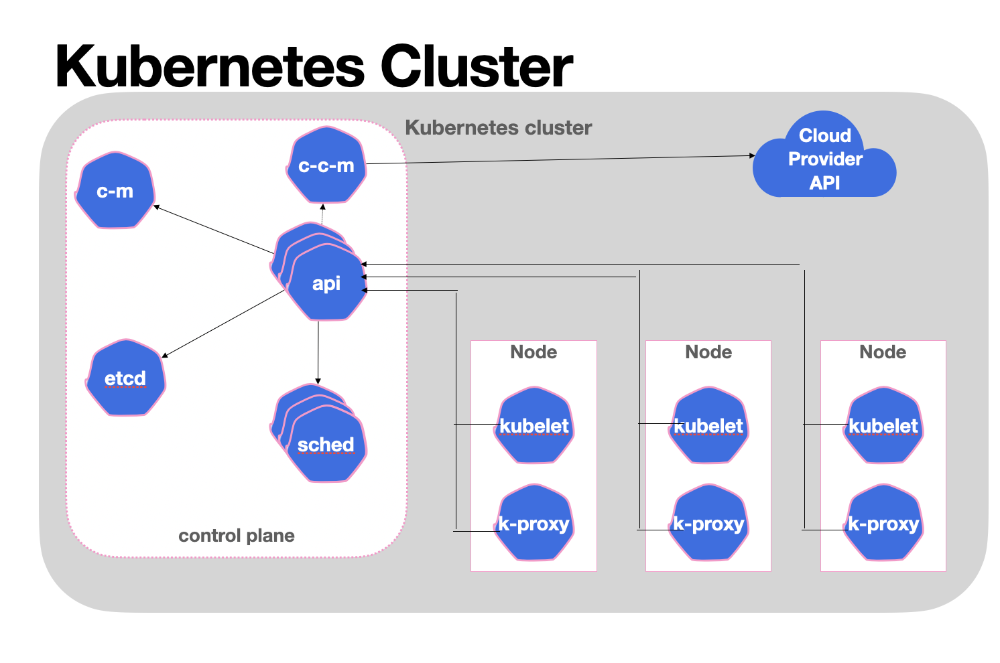

==== generated by pydiagrams/k8s_cluster_diagram.py
image:gallery/diagrams_kubernetes_cluster.png[diagrams_kubernetes_cluster,1000,,link="https://github.com/Lina-Liuna/Arch_Concept/blob/main/gallery/diagrams_kubernetes_cluster.png"]

==== Node Pod Container
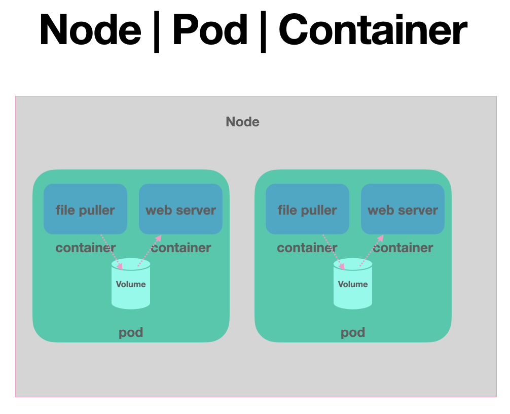

2. Operating System - three easy pieces

==== Operating System 3 easy pieces Contents
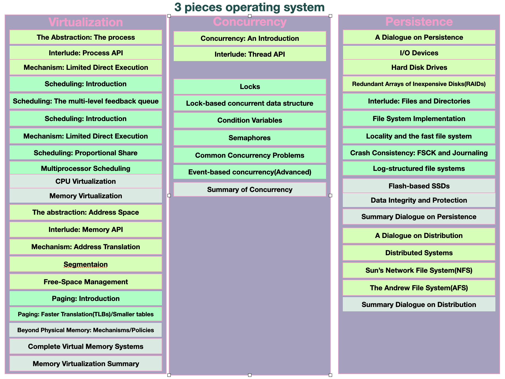

==== CPU Virtualization
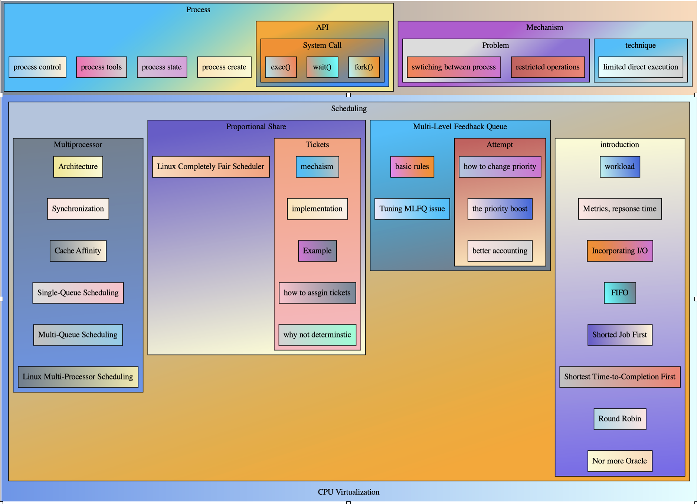

==== Memory Virtualization
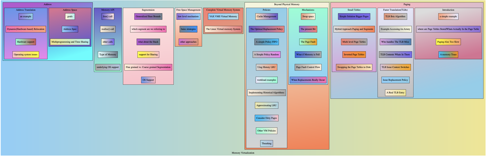

==== Concurrency

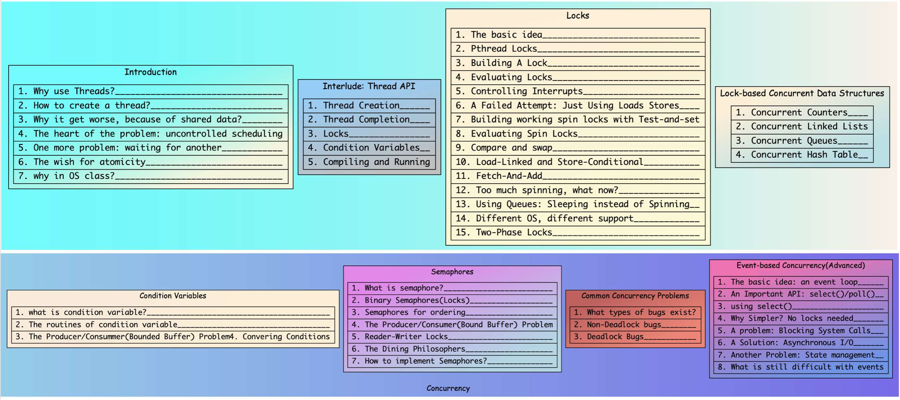

==== Persistence

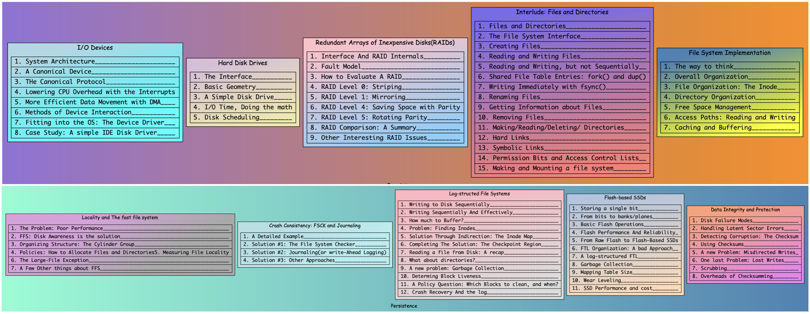

==== what_happes_when_a_program_runs

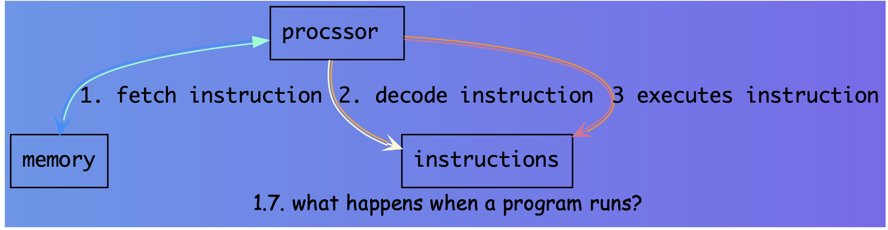

==== os_as_a_virtual_machine

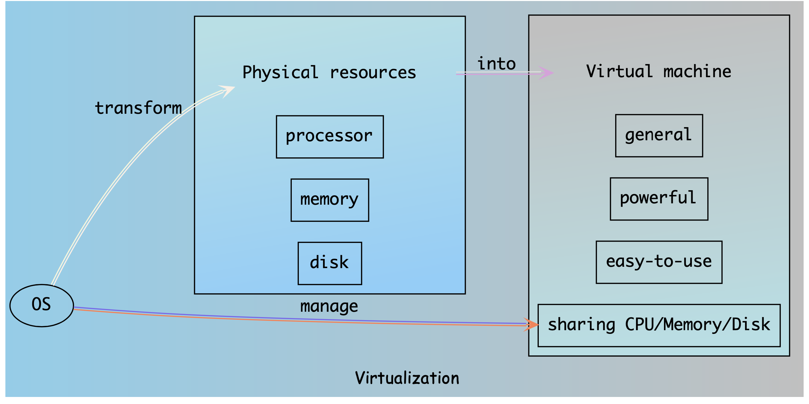

==== virtualizing_the_CPU

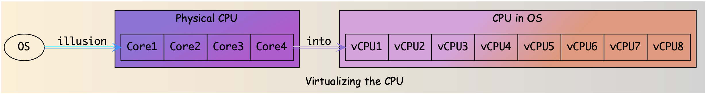

3. Network
4. ...