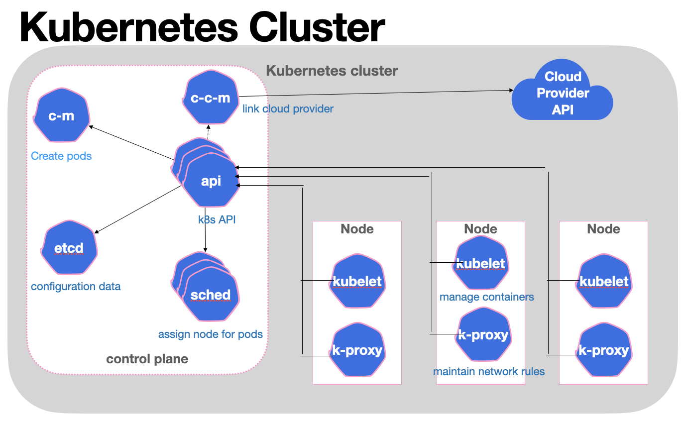

basic concept of:

= Cloud computing

=== Kubernetes

==== CNCF organization members

==== Deployment

==== Kubernetes Cluster

==== Node Pod Container
image:gallery/Node_Pod_Container.png[Node_Pod_Container,1000,,link="https://github.com/Lina-Liuna/Arch_Concept/blob/main/gallery/Node_Pod_Container.png"]

2. Operating System - three easy pieces

==== Operating System 3 easy pieces Contents
image:gallery/Operating_System_3_easy_pieces_Contents.png[Operating_System_3_easy_pieces_Contents,1000,,link="https://github.com/Lina-Liuna/Arch_Concept/blob/main/gallery/Operating_System_3_easy_pieces_Contents.png"]

3. Network
4. ...