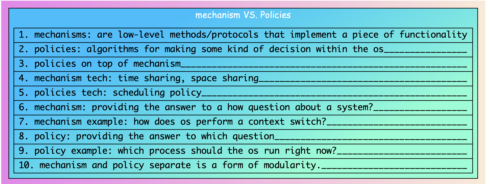
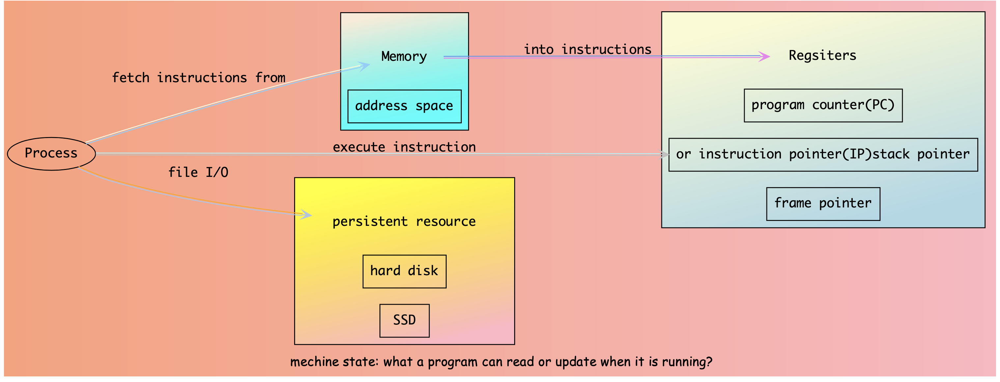
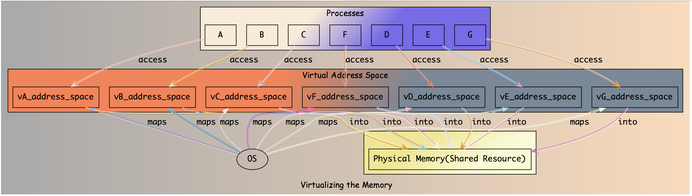
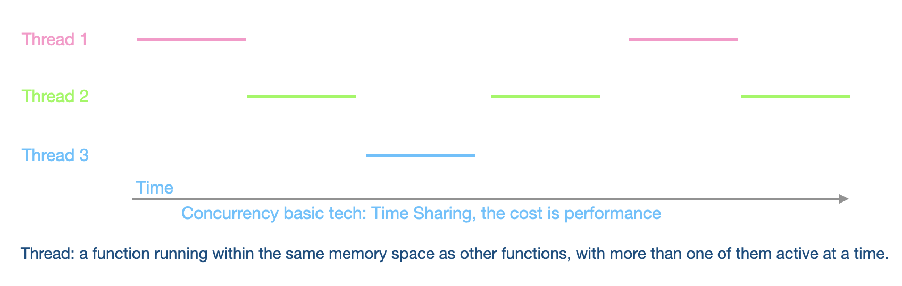
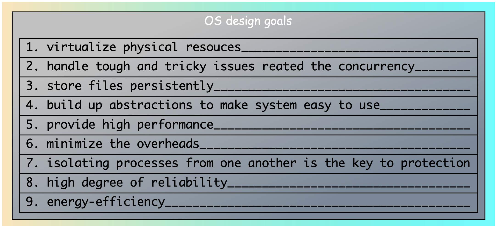
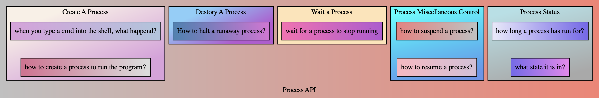

basic concept of:

= Cloud computing

=== Kubernetes

==== CNCF organization members

image:gallery/CNCF_organization_members.png[CNCF_organization_members,1000,,link="https://github.com/Lina-Liuna/Arch_Concept/blob/main/gallery/CNCF_organization_members.png"]

==== Deployment

image:gallery/Deployment.png[Deployment,1000,,link="https://github.com/Lina-Liuna/Arch_Concept/blob/main/gallery/Deployment.png"]

==== Kubernetes Cluster
image:gallery/Kubernetes_Cluster.png[Kubernetes_Cluster,1000,,link="https://github.com/Lina-Liuna/Arch_Concept/blob/main/gallery/Kubernetes_Cluster.png"]

==== generated by pydiagrams/k8s_cluster_diagram.py
image:gallery/diagrams_kubernetes_cluster.png[diagrams_kubernetes_cluster,1000,,link="https://github.com/Lina-Liuna/Arch_Concept/blob/main/gallery/diagrams_kubernetes_cluster.png"]

==== Node Pod Container

2. Operating System - three easy pieces

==== Operating System 3 easy pieces Contents

==== mechanism_policies

==== CPU Virtualization

==== Memory Virtualization
image:gallery/Memory_Virtualization.png[Memory_Virtualization,1000,,link="https://github.com/Lina-Liuna/Arch_Concept/blob/main/gallery/Memory_Virtualization.png"]

==== Concurrency

==== Persistence

image:gallery/Persistence.png[Persistence,1000,,link="https://github.com/Lina-Liuna/Arch_Concept/blob/main/gallery/Persistence.png"]

==== what_happes_when_a_program_runs

==== what_a_program_can_read_or_update_when_it_is_running

==== os_as_a_virtual_machine

==== virtualizing_the_CPU

==== Virtualizing_the_memory

==== multi_thread_concurrency

==== OS_design_Goals

==== process API

3. Network
4. ...